# 说明

### 因网络问题看不到README文档图片请下载后使用markdown工具查看

## 环境

- Quartus Prime 19.1 Lite Edition

- 相关链接[FPGA 设计软件 - 英特尔® Quartus® Prime (intel.cn)](https://www.intel.cn/content/www/cn/zh/products/details/fpga/development-tools/quartus-prime/resource.html)

## 代码使用方法

1. 在quartus中新建工程时，顶层模块名设置为MyClock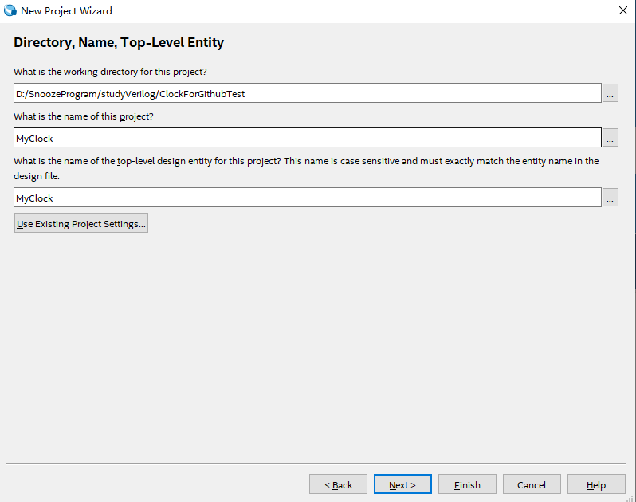
2. 把拉取的代码放到工程文件夹目录下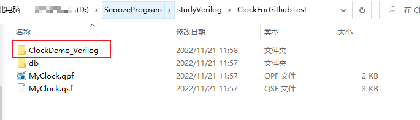
3. 栏目选择files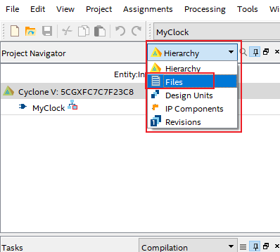
4. 右键添加文件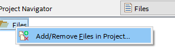
5. 打开文件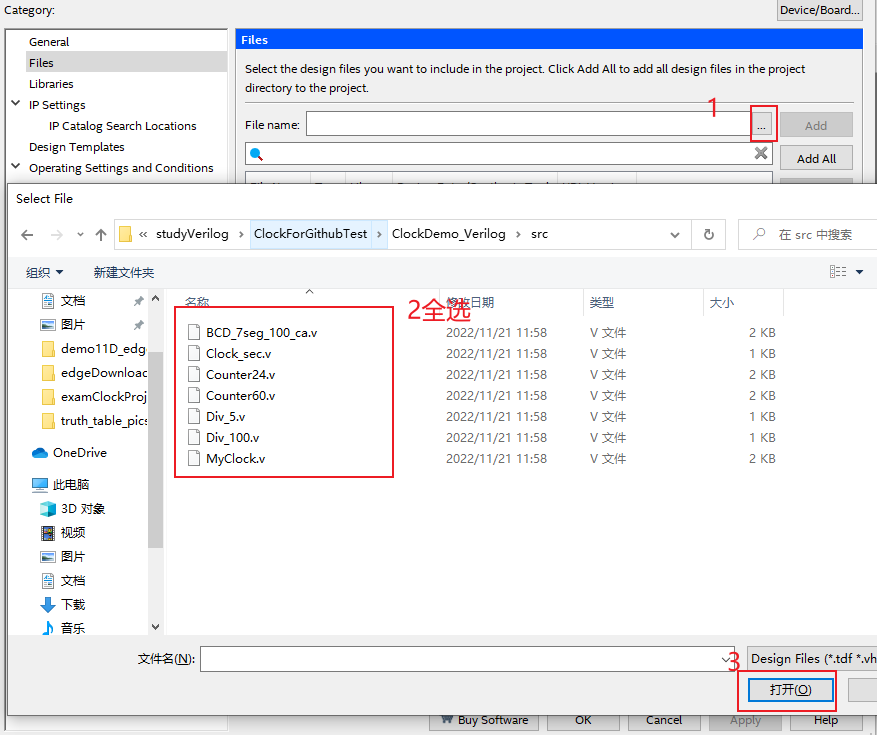
6. 选完点击 ok 后在左侧可看到文件列表
7. 直接可以开始编译

## 查看RTL图

1. 需要先编译完成
2. 如图操作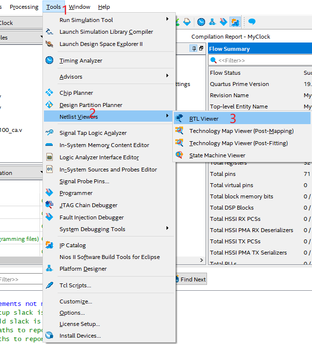
3. 如图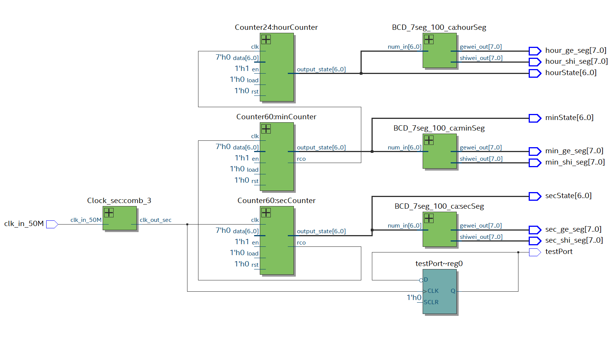

## 仿真参考

1. 新建矢量波形文件文件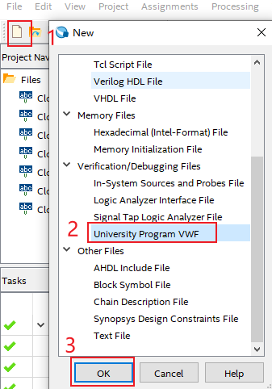
2. 插入端口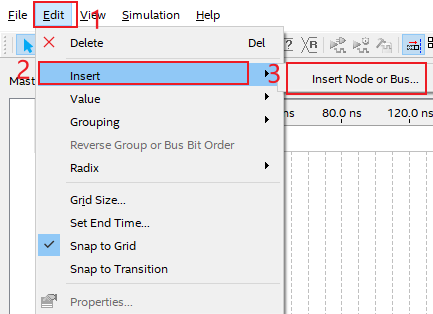
3. 使用Node Finder快速寻找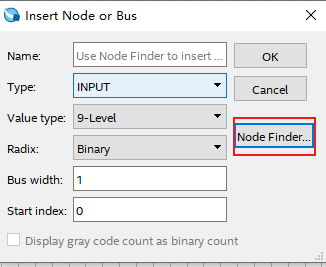
4. 一键导入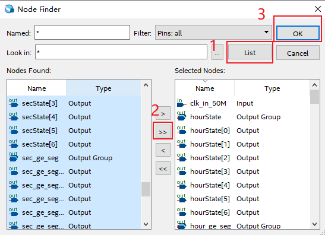
5. 设置波形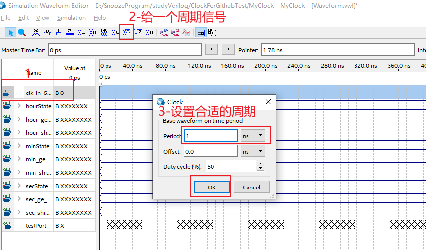
6. 点击按钮 Run Functional Simulation，然后保存文件的时候建议**不要改文件名字** ，即可开始仿真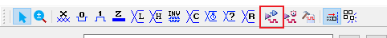